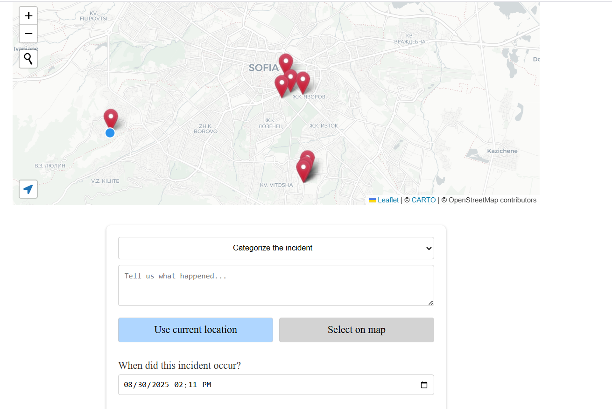
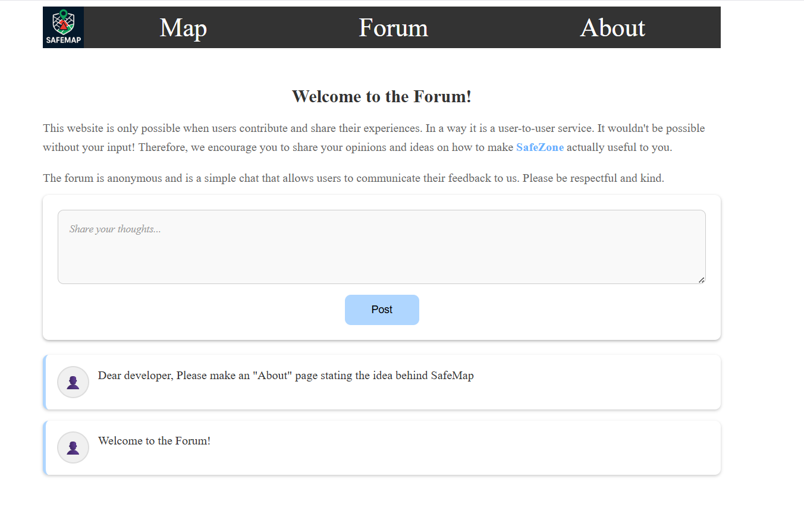
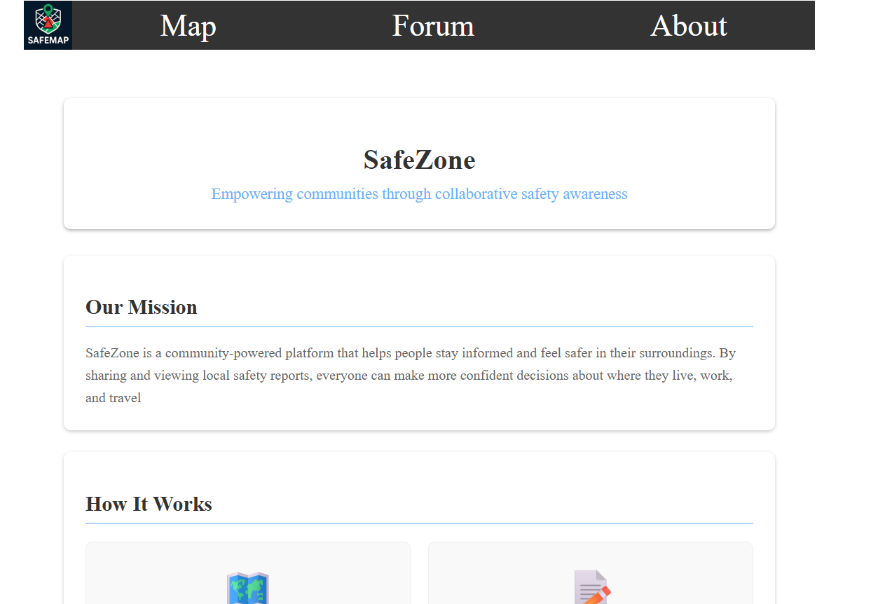

# 🛡️ SafeZone

SafeZone is a community-powered safety awareness platform built with React and Firebase.  
It enables users to share and view safety reports anonymously, browse an incident map, and connect through a simple community forum — all with privacy by design.
Deployed via Docker on Heroku
Visit here: [SafeMap](https://safemap-8e8ffc338a58.herokuapp.com/)

---

## 🌍 Features

- 🗺 **Interactive Map** – View safety reports in real time relevant to your location, powered by Leaflet.  
- 📝 **Anonymous Reporting** – Submit incidents with precise location, category, and timestamp.  
- 💬 **Minimal Forum** – Post and read short messages without usernames or accounts.  
- 📱 **Responsive Design** – Works on both mobile and desktop.  
- 🔒 **Privacy First** – No personal data stored or tracked.  
---

## ⚙️ Tech Stack

**Frontend:**  
- React + Vite  
- Leaflet & React-Leaflet  
- Custom CSS (with AI-assisted refinements for faster iteration)  

**Backend / Database:**  
- Firebase Firestore (real-time, document-oriented)

**Development:**  
- Git version control  
- Component-based architecture  
- Docker for deployment
---

## 🚀 Future Possibilites

- Anti-spam & anti-bot features  
- Analytics and safety heatmaps  
- Integration with local emergency services  

---
## 📸 Screenshots

- Map view with incident reports –  
- Forum with anonymous posts – 
- About page – 

SafeZone was built to demonstrate full-stack development skills while solving a real-world problem.  
It highlights:
- Real-time data handling with Firebase  
- Interactive mapping with custom markers  
- Anonymous community features  
- Responsive UI/UX design
